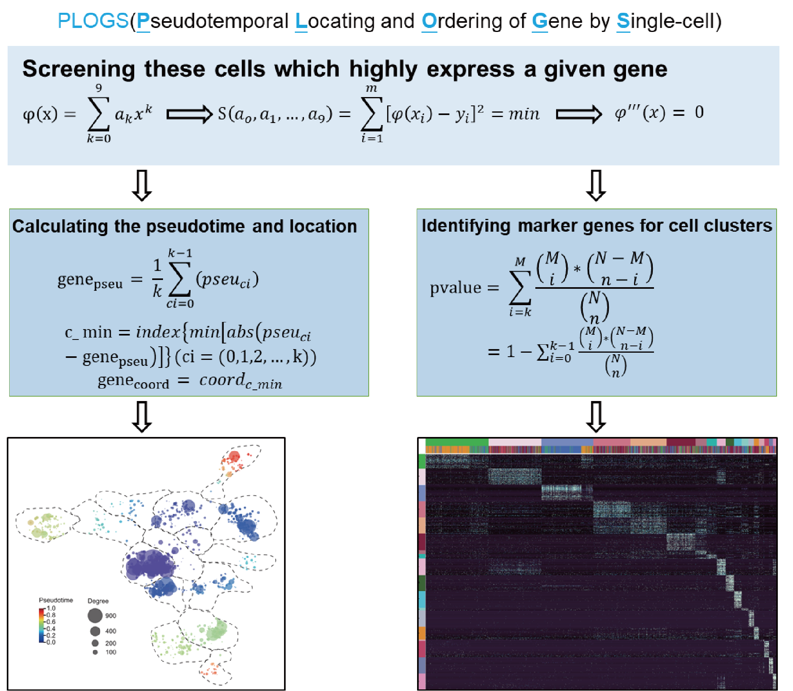

# PLOGS(Pseudotemporal Locating and Ordering of Gene by Single-cell)

PLOGS is a tool to identify marker genes for cell clusters, calculate the pseudotime of genes and profile genes map accoding to cell map. It can be directly used in the [scanpy](https://scanpy.readthedocs.io/en/latest/) workflow. 

<p align="center"></p>

PLOGS consists of three core functions: 
* (i) `get_DEG_single` to find genes that are differentially expressed in only one cell type based on normalized raw counts of scRNA-seq data; 
* (ii) `get_DEG_multiple` to find genes that are differentially expressed in one or more  cell types based on normalized raw counts of scRNA-seq data; 
* (iii) `get_genes_pseudotime_location` to calculate the pseudotemporal expression of individual genes based on pseudotime ordering of cells and to locate genes into suitable coordinates based on the cells’ locations. 

## Citation

If you use PLOGS in your work, please cite the [paper](https://xxx.com):

	@article{BaoZhang2019PLOGS,
	  title={PLOGS:Pseudotemporal Locating and Ordering of Gene by Single-cell},
	  author={BaoZhang},
	  doi={xxx},
	  journal={xxx},
	  year={2019}
	}

## Installation

PLOGS depends on numpy, scipy, pandas, scanpy,anndata. The package is available on pip and conda, and can be easily installed as follows:

	pip3 install PLOGS

or

	conda install -c bioconda PLOGS

## Usage and Documentation
* identifing marker genes for cell clusters: <br>
PLOGS has the option to slot into the spot occupied by `scanpy.tl.rank_genes_groups()` in the scanpy workflow](https://scanpy-tutorials.readthedocs.io/en/latest/pbmc3k.html). The basic syntax to run on scanpy's AnnData object is as follows:
```python
import PLOGS
PLOGS.get_DEG_single(rdata, adata) #find genes that are differentially expressed in only one cell type
```
or
```python
PLOGS.get_DEG_multiple(rdata, adata) #find genes that are differentially expressed in one or more  cell types
```
the `rdata` is the anndata after `sc.pp.normalize_per_cell(adata)` and `sc.pp.log1p(adata)` in scanpy;
the `adata` is the annData processed by scanpy from `sc.pp.highly_variable_genes` to `sc.tl.leiden(adata)`.
You can provide which `adata.obs` column to use for via the `group_key` parameter. This defaults to `'leiden'`, which is created by scanpy when you run `sc.tl.leiden(adata)`.

* calculate the pseudotime of genes and profile genes map accoding to cell map:<br>
```python
import PLOGS
PLOGS.get_genes_location_pseudotime(rdata, adata)
```
the `rdata` is the anndata after `sc.pp.normalize_per_cell(adata)` and `sc.pp.log1p(adata)` in scanpy;
the `adata` is the annData processed by scanpy from `sc.pp.highly_variable_genes` to `sc.tl.leiden(adata)`.
You can provide:<br>
* which `adata.obs` column to use for via the `group_key` parameter. This defaults to `'leiden'`, which is created by scanpy when you run `sc.tl.leiden(adata)`
* `markers_s` or `markers_m` to use for via the `gene_matrix` parameter. This defaults to `'markers_s'`, which is created by PLOGS when you run `PLOGS.get_DEG_single(rdata, adata)` and saved in `adata.uns` column; the `marker_m` is created by PLOGS when you run `PLOGS.get_DEG_multiple(rdata, adata)` and saved in `adata.uns` column.
* which `adata.obsm` column to use for via the `obsm` parameter.
## Example Notebooks

* The [PBMC_markers_identification.ipynb](https://nbviewer.jupyter.org/github/Teichlab/bbknn/blob/master/examples/pancreas.ipynb) is a demonstration to identify marker genes;

* The [PBMC_gene_map.ipynb](https://nbviewer.jupyter.org/github/Teichlab/bbknn/blob/master/examples/pancreas.ipynb) is a demonstration to calculate the pseudotime of genes and profile genes map accoding to cell map. 
