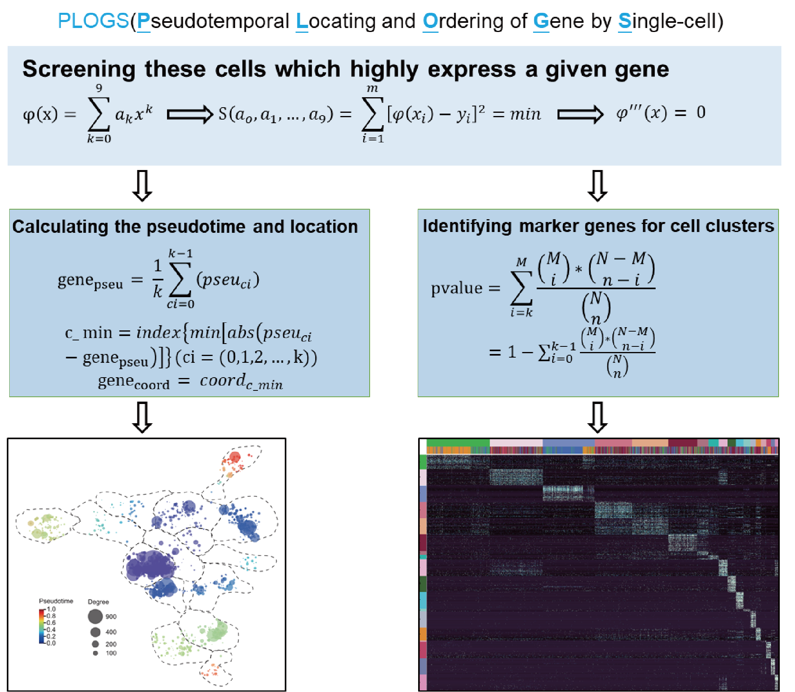

# DEAPLOG(Differentially Expression Analysis and Pseudotemporal Locating and Ordering of Gene by Single-cell RNA-seq data)

DEAPLOG is a tool to perform differentially expression analysis for cell clusters and other conditions, calculate the pseudotime of genes and profile genes coordinates accoding to the embedding coordinates of cells.

<p align="center"></p>

DEAPLOG consists of three core functions: 
* (i) `get_DEG_uniq` to find genes that are differentially expressed in only one cell type based on normalized raw counts of scRNA-seq data; 
* (ii) `get_DEG_multi` to find genes that are differentially expressed in one or more  cell types based on normalized raw counts of scRNA-seq data; 
* (iii) `get_genes_location_pseudotime` to calculate the pseudotemporal expression of individual genes based on pseudotime ordering of cells and to locate genes into suitable coordinates based on the embedding coordinates of cells, such as 'X_umap', 'X_diffmap' and 'X_tsne'. 

## Citation

If you use PLOGS in your work, please cite the paper:

	@article{BaoZhang2019PLOGS,
	  title={DEAPLOG:Differentially Expression Analysis and Pseudotemporal Locating and Ordering of Gene by Single-cell RNA-seq Data},
	  author={BaoZhang},
	  doi={xxx},
	  journal={xxx},
	  year={2022}
	}

## Installation

PLOGS depends on numpy, scipy, pandas, scanpy,anndata. The package is available on pip and conda, and can be easily installed as follows:

	pip install DEAPLOG

## Usage and Documentation
### 1. identifing marker genes for cell clusters: <br>
The inputs of DEAPLOG is the AnnData object of normlized counts of scRNA-seq data with pre-annotated cell clusters.  
```python
DEAPLOG.get_DEG_uniq(rdata, adata,group_key='leiden',power=8,ratio=0.2,p_threshold=0.01,q_threshold=0.05) #find genes that are differentially expressed in only one cell type
```
or
```python
DEAPLOG.get_DEG_multi(rdata, adata,group_key='leiden',power=8,ratio=0.2,p_threshold=0.01,q_threshold=0.05) #find genes that are differentially expressed in one or more  cell types
```
the `rdata`: the Anndata of normlized counts of scRNA-seq data;<br>
the `adata`: the Anndata of scRNA-seq data with pre-annotated cell clusters;<br>
the `group_key`: the label for cell clusters;<br>
the `power`: a parameter for nonlinear regression of gene expression pattern;<br>
the `ratio`: the proportion of gene expression in cell cluter;<br>
the `ratio`: the proportion of gene expression in cell cluter,the value is between 0 and 1;<br>
the `p_threshold` : the threshold of p-value. the value is between 0 and 1;<br>
the `q_threshold` : the threshold of q_value. the value is between 0 and 1;<br>
### 2. calculate the pseudotime of genes and profile genes map accoding to cell map:<br>
```python
DEAPLOG.get_genes_location_pseudotime(rdata, adata,group_key='leiden',power=8,gene_matrix= markers_s,obsm='X_umap',)
```
the `rdata`: the Anndata of normlized counts of scRNA-seq data;<br>
the `adata`: the Anndata of scRNA-seq data with pre-annotated cell clusters;<br>
the `group_key`: the label for cell clusters;<br>
the `power`: a parameter for nonlinear regression of gene expression pattern;<br><br>
the `gene_matrix`: a data.frame producted by get_DEG_uniq or get_DEG_multi.
the `obsm`: the keys of adata.obsm. 
